<div align="center">

# Character Sheet

**Know Your Party** — RPG-style personality interview. Answer eight sections about your gaming, anime, film and hobby taste, get an RPG class, then export a card worth actually sharing — and compare cards with your team.

[![Live][badge-site]][url-site]
[![HTML5][badge-html]][url-html]
[![CSS3][badge-css]][url-css]
[![JavaScript][badge-js]][url-js]
[![Claude Code][badge-claude]][url-claude]
[![License][badge-license]](LICENSE)

[badge-site]:    https://img.shields.io/badge/live_site-0063e5?style=for-the-badge&logo=googlechrome&logoColor=white
[badge-html]:    https://img.shields.io/badge/HTML5-E34F26?style=for-the-badge&logo=html5&logoColor=white
[badge-css]:     https://img.shields.io/badge/CSS3-1572B6?style=for-the-badge&logo=css3&logoColor=white
[badge-js]:      https://img.shields.io/badge/JavaScript-F7DF1E?style=for-the-badge&logo=javascript&logoColor=black
[badge-claude]:  https://img.shields.io/badge/Claude_Code-CC785C?style=for-the-badge&logo=anthropic&logoColor=white
[badge-license]: https://img.shields.io/badge/license-MIT-404040?style=for-the-badge

[url-site]:   https://charactersheet.neorgon.com/
[url-html]:   #
[url-css]:    #
[url-js]:     #
[url-claude]: https://claude.ai/code

</div>

---

## Overview

**Character Sheet** is a personality interview that builds an RPG-style character card from your answers — the thing you hand round in a first meeting instead of saying your job title twice. Eight themed sections, an auto-assigned RPG class, and an export designed to survive being pasted into Slack.

**Live:** [charactersheet.neorgon.com](https://charactersheet.neorgon.com/)

## Features

- **Eight-section interview** — Identity, Your Story, Gaming, Anime, Movies & Series, Hobbies, Hot Takes, Extras, with live per-section progress
- **Media search** — real games, anime and films via a Cloudflare Worker proxying RAWG, Jikan and TMDB; cover art and character portraits land on the card
- **RPG class auto-assignment** — your answers pick the class (Digital Ronin, Screen Sage, Pixel Paladin, and six more)
- **The card is real HTML** — themes are CSS custom properties, layouts are CSS grid and multicol. The element on screen *is* the element exported, so a preview that looks right cannot produce a wrong PNG
- **Five size presets** — Portrait (grows to fit), Wide 1600×900 for a Slack or Teams preview, Square 1080×1080, A4, and Compact. Fixed sizes drop the lowest-priority sections by measured overflow and say what they dropped
- **PNG at 1×, 2× or 3×** — rasterised from an SVG `foreignObject`, a genuine re-render at scale rather than an upscaled bitmap
- **Vector PDF** — printed through `@media print`, so the text stays selectable
- **Share link + QR** — the whole sheet compresses into the URL fragment, so nothing is uploaded and the read-only card page works from the link alone. The two-truths answer is stripped *at the encoder*, not merely unrendered
- **Presenter deck and script** — a standalone HTML slide deck and a Markdown script, both agreeing with the card on the shuffled two-truths order, with the answer folded away
- **Party board** — drop in several cards and it finds the overlaps: titles more than one person listed, the hours everyone is actually reachable, class composition, and icebreakers that name the real game and the real people
- **Randomize button** — fills a plausible sheet for quick testing

## Party board

`party.html` takes card links, `.json` sheets, or the sheet in your own browser and reports where a team overlaps:

- **Timezone coverage** — a 24-cell UTC grid shaded by how many people are inside a 09:00–18:00 local window, plus the longest run where the most people are free. Anyone without a timezone is named as uncounted rather than quietly dropped
- **Common ground** — shared titles, hobbies and genres, ranked so a game three people named outranks a platform everyone ticked. A row needs two people by definition
- **Only one of you** — titles nobody else listed, which is the easiest thing to ask about
- **Class composition** and **Start here** — prompts built from the roster, each one checkable against a real sheet
- **Copy summary** — the board as Slack mrkdwn, and **Copy roster link** — the whole roster in one fragment

Rosters are not uploaded either. Nothing on this board reads anybody's two-truths answer.

## Architecture



Modular ES module app following the standard project layout:

```
character-sheet-site/
├── index.html            # The interview + card modal
├── card.html             # Read-only shared card, decoded from the URL fragment
├── party.html            # Team party board
├── css/
│   ├── style.css         # App shell
│   ├── card.css          # The card — self-contained, serialised into the export SVG
│   ├── reader.css        # The shared-card page
│   └── party.css         # The party board
├── js/
│   ├── app.js            # Entry point
│   ├── sheet.js          # The sheet's shape, dependency-free
│   ├── state.js          # The live sheet + Convex client
│   ├── data.js           # Section data, RPG classes, fill scoring
│   ├── render.js         # Section rendering
│   ├── events.js         # Delegated event routing
│   ├── builder.js        # Card builder step (avatar, which media)
│   ├── present.js        # Presenter deck + script
│   ├── reader.js         # card.html
│   ├── party.js          # party.html
│   ├── party/analyze.js  # Team pattern analysis — pure functions
│   ├── card/
│   │   ├── model.js      # State → priority-ranked blocks
│   │   ├── presets.js    # Themes and layouts, as data
│   │   ├── render.js     # Blocks → DOM, plus the measured fit pass
│   │   ├── export.js     # PNG via SVG foreignObject; PDF via print
│   │   ├── media.js      # Which images a sheet offers
│   │   └── panel.js      # The card modal
│   ├── share/
│   │   ├── link.js       # Sheet ⇄ URL fragment (gzip + base64url)
│   │   └── qr.js         # QR generated locally
│   ├── api.js            # Worker-proxied media search
│   ├── utils.js          # Shared helpers
│   └── testdata.js       # Randomize
├── convex/               # Optional multi-sheet storage (Clerk auth)
└── worker/               # Cloudflare Worker proxying RAWG / Jikan / TMDB
```

**Tech:** HTML + CSS + ES modules, no build step. The card is DOM and CSS rather than canvas, which is what makes themes data, layouts CSS, and PDF text vector. Optional Convex + Clerk for saving several sheets; media search goes through the Worker so no API key reaches the browser.

## Run locally

```bash
make serve    # http://localhost:8814
make kill     # stop it
```

ES modules require an HTTP server — `file://` will not work. No install and no keys are needed: media search calls the deployed Worker, which holds the API keys server-side. Convex-backed sheet saving is optional (`npm install && npx convex dev`).

---

<div align="center">

Part of [Neorgon](https://neorgon.com)

</div>
